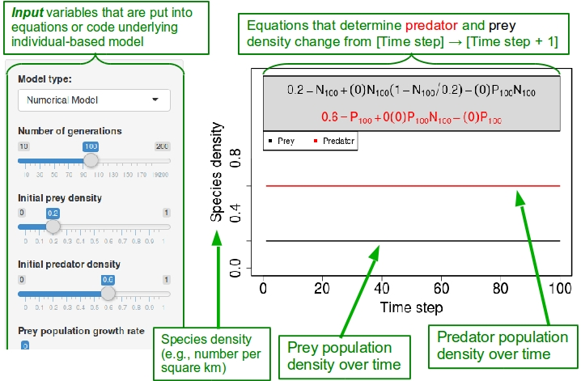
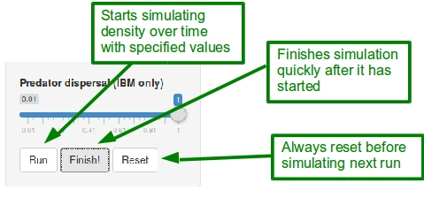
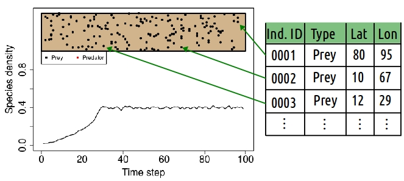
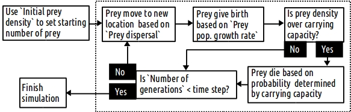

******************************

This lab will introduce ecological models by simulating how species abudances change over time in predator-prey interactions. **First**, this lab will explore discrete time mathematical models of predator-prey interactions using Lotka-Volterra equations. This type of model has a long history in the development of ecological theory. The term "discrete time" means that the model considers how predator and prey populations change from one individual time step to the next, i.e., from `t` to `t+1`. In contrast, in a "continuous time" model, time would be smooth, not be broken up into individual steps. The term "mathematical model" means that species abundances (or densities -- e.g., number of individuals per km) are represented by numbers, and equations can be used to predict how abundances change over time. In contrast, an "individual-based model" (sometimes called an "agent-based model") is the **second** type of model this lab will explore. This type of model also simulates discrete (as opposed to continuous) time, but it does not use numbers directly to represent population abundances, nor equations to predict how populations change. Instead, the individual-based model used here will track individuals explicitly, simulating their births and deaths explicitly using an algorithm written in the R programming environment. 

**The goal of this lab is to introduce you to thinking about how ecological models can be used as a tool for more clearly thinking about how populations change over time, specifically connecting mechanisms of population dynamics and species interactions to predictions about population densities. This goal will be accomplished by connecting ecologically important processes that affect population change (e.g., birth, death, and predation) to the mathematical equations or simulated events that model changing species densities, and by comparing predictions between model types. At the end of this lab, you should therefore be able to use simple ecological models as conceptual tools for making inferences about population change.**

********************************

Getting started
===========================================

We will first look at how to use the educational software, which can be accessed in an Internet browser at <https://bradduthie.shinyapps.io/EcoEdu/>. The interface of this software allows you to specify variables that affect population dynamics in the left panel; the output of these variables simulates preadator and prey populations over time in the right panel.

<br>

> **Note**: This program might flicker when plotting graphs and equations. To avoid this and finish any simulation, simply click the *Finish* button in the bottom left panel.

<br>

The image below shows the interface of the software. 



<br>

When the browser is first loaded (or refreshed), the panel on the right is not visible. The pulldown menu on the left allows you to specify the type of model that you want to run, either mathematical or individual-based. Below this pulldown menu, all of the sliders allow you to adjust key variables in the model (the bottom two variables adjust how far individuals move, and only effect population change in the individual-based model). The output produced from these variables is presented in two ways on the right-hand panel. First, what the model is doing is shown in the coloured box. In the case of the mathematical model, this box is grey, and it shows how the variables you put into the left panel are used in equations calculating prey and predator densities (more on this later). In the case of the individual-based model, this box is tan, and it shows individuals moving around in a simulated environment. The plot beneath the coloured box shows how prey (black) and predator (red) densities are predicted to change over time given the variables you put into the left panel.

To run a simulation, click the `Run` button at the bottom of the left panel. This will start a simulation, and you should see what the model is doing (coloured box) to predict species densities over time (plotted lines). To finish a simulation quickly, click the `Finish` button. Before running another simulation, be sure to click the `Reset` button.

<br>



This should be all that you need to know to start exploring predator-prey ecological models. If at any time the software appears to have crashed, first try clicking the `Reset` button. If that fails, refreshing the page in your browswer should work.

********************************

<br>

Mathematical model: prey population growth
===========================================

First we will explore a simple discrete time Lotka-Volterra model of prey population growth in the absence of predators. Prey population dynamics are modelled using the following equation:

$$ N_{t+1} = N_{t} + r N_{t} \left(1 - \frac{N_{t}}{K}\right)  $$

In the above equation, $N_{t+1}$ is the density of the prey species being predicted. The number shows up on the left side of the equation in the coloured box and is plotted in black on the y-axis. The variable $N_{t}$ is the prey species' density in the previous time step. The parameter $r$ is the `Prey population growth rate` that you set in the left panel; this is also called the *intrinsic rate of increase* of the prey population -- i.e., the rate at which the population will grow in the absence of anything that would otherwise slow it down, such as carrying capacity or predation. The parameter $K$ is the `Prey density carrying capacity` that you set in the left panel. *Carrying capacity* is the maximum sustainable size of the population, as might be determined by limited food or habitat availability. To understand how $r$ and $K$ affect prey population growth, we will vary each and look at the plotted output.

**Change model parameters to the following values**:

```
Model parameter                   | Set value
----------------------------------|------------
Number of generations             | 100
Initial prey density              | 0.02
Initial predator density          | 0
Prey population growth rate       | 0.2
Predator population decline rate  | 0
Attack rate of predators          | 0
Prey density carrying capacity    | 0.4
Predator births per attack        | 0
```


Hit `Run` and observe how the prey population density changes over time. Find the values you set for `Prey population growth rate` and `Prey density carrying capacity` in the equation shown in the grey box. Try to connect how those values you specified on the right side of the equation affect the value on the left side of the equation. Next, notice how the solution on the left side of the equation is plotted on the y-axis below. If you want to see this more than once, press the `Reset` button, then the `Run` button again.

To understand how `Prey population growth rate` affects the population growth you just observed, first think about how the $r$ parameter value affects the left-hand side of the equation (i.e., what will happen to $N_{t+1}$ if you increase $r$?). Then, **increase the prey population growth rate; do not change any other values**:

```
Model parameter                   | Set value
----------------------------------|------------
Prey population growth rate       | 0.6
```

Hit `Run` and again observe how the prey population density changes over time.

> **QUESTION 1**: How has prey population growth changed after increasing intrinsic growth rate? Explain this in 1-3 sentences, both in terms of the mathematical model and the plotted growth curve.

Hit `Reset`. Next, we'll look at how `Prey density carrying capacity` affects population growth. To do this **increase the prey density carrying capacity; do not change any other values**:

```
Model parameter                   | Set value
----------------------------------|------------
Prey density carrying capacity    | 0.7
```

Hit `Run` and again observe how the prey population density changes over time.

> **QUESTION 2**: How has prey population growth changed after increasing intrinsic carrying capacity? Explain this in 1-3 sentences, both in terms of the mathematical model and the plotted growth curve.

Hit `Reset`. After thinking about **Question 2**, consider what you think will happen if initial prey density is set to something higher than carrying capacity. Try this out by **increasing initial prey population density**:

```
Model parameter                   | Set value
----------------------------------|------------
Initial prey density              | 0.8
```

Think about how population changed over time when `initial prey density` exceeded `prey density carrying capacity`, then, **change the initial prey density back to a lower value**:

```
Model parameter                   | Set value
----------------------------------|------------
Initial prey density              | 0.20
```

Hit `Reset` (also, note that the above value is 0.2, not 0.02). Try running this simulation once with the new parameter combinations. Next, we'll look at what happens when we introduce a predator into the system.

********************************

<br>

Mathematical model: predators and prey
===========================================

We can introduce a predator into our above discrete time Lotka-Voltera model of prey growth using the following equation: 

$$ N_{t+1} = N_{t} + r N_{t} \left(1 - \frac{N_{t}}{K}\right) - a P_{t} N_{t} $$

Note that the term $a \times P_{t} \times N_{t}$ is now subtracted from the right side of the previous equation in which prey population growth was modelled in the absence of predators. The new equation therefore builds on the previous equation to account for the effects of predation. The density of the prey in the next time step $N_{t+1}$ is reduced by some amount that depends on the `attack rate of predators` ($a$, i.e., how good a predator is at finding and eating prey) *and* the density of predators that there are to attack ($P_{t}$) *and* the density of prey there are to be attacked ($N_{t}$). This new addition to the prey growth rate therefore introduces $P_{t}$ and $a$. Note that *increasing* $a$ or $P_{t}$ *decreases* the density of prey in the next generation ($N_{t+1}$). Think about this in terms of the biology -- try to connect this part of the equation affecting prey growth to what you know about predation.

Next, we need an equation to model how predator density changes from one time step to the next ($P_{t} \to P_{t+1}$). Predator population dynamics are modelled using the following equation:

$$ P_{t+1} = P_{t} + a(b)P_{t}N_{t} - \delta P_{t} $$

There are a couple new variables here, but first note that the first term on the left hand side of the equation is $P_{t}$, the density of predators in the previous time step. The second term, $a(b)P_{t}N_{t}$ models the growth of the predator population. Notice that this added second term is identical to the subtracted term on the right hand side of the prey equation ($a P_{t} N_{t}$), except that we've added the variable $b$. This shold make biological sense -- the growth of the predator population is going to be closely related to the number of prey eaten, and therefore subtracted from the prey equation. The addition of the $b$ variable is the number of `predator births per attack`. If predators are very efficient at using successful attacks to reproduce, then $b$ will be high; if predators are inefficient at reproducing, then $b$ will be low. The last term of on the right hand side of the equation affecting predator growth is $\delta P_{t}$, where $\delta$ is the `predator population decline rate` (i.e., predator "mortality" or "death rate", $\delta$), which is multiplied by the density of predators there are at `t` that can die ($P_{t}$). For simplicity, we are therefore assuming that predators, unlike prey, do not have their own carrying capacity -- their rate of population growth is regulated entirely by their ability to eat prey and use it to reproduce ($a(b)P_{t}N_{t}$), and by a fixed probability of mortality ($\delta P_{t}$). Try to think about the equation affecting predator growth in terms of the biology; the following excercises should help both of the above equations become easier to understand.

The above two equations that model will appear in the grey coloured box, and you will see both prey (black lines) and predator (red lines) plotted out over time steps. To add a predator into the model, **change the model parameters to the values listed below**:


```
Model parameter                   | Set value
----------------------------------|------------
Number of generations             | 100
Initial prey density              | 0.2
Initial predator density          | 0.05
Prey population growth rate       | 0.6
Predator population decline rate  | 0.2
Attack rate of predators          | 1.1
Prey density carrying capacity    | 0.7
Predator births per attack        | 0.5
```

Hit `Run` and observe how both prey and predator population densities change over time. Connect the parameter values above that you put into the left panel with the equations in the grey box, and think about what these numbers are doing to affect prey and predator population densities.

> **QUESTION 3**: Describe the population growth of both prey and predators. How does the addition of predators affect prey growth (hint: if it helps, re-run the simulation and set `Initial prey density` to zero)? Explain this in 1-3 sentences, both in terms of the mathematical model and the plotted growth curves.

Hit `Reset`. After thinking about **Question 3**, consider what you think will happen when predator death occurs too frequently (i.e., when $\delta$ in the above equation increases). To clarify your thinking using the mathematical model, **change the predator population decline rate to the following parameter value**:

```
Model parameter                   | Set value
----------------------------------|------------
Predator population decline rate  | 0.4
```

Note that the value is now higher, which means that a bigger number is being subtracted in the equation defining $P_{t+1}$. Hit `Run` and observe prey and predator dynamics over time.

> **QUESTION 4**: What happened to prey and predator populations when `Predator population decline rate` was increased?  Explain this in 1-3 sentences, both in terms of the mathematical model and the plotted growth curves.

Hit `Reset`. Now, **change the predator population decline rate back to 0.2**:

```
Model parameter                   | Set value
----------------------------------|------------
Predator population decline rate  | 0.2
```

Now think about what would happen if, instead of increasing the `Predator population decline rate` ($\delta$) -- and thereby *lowering* the survival of predators -- you *lowered* the rate at which predators attacked prey ($a$). Should lowering predator attack rate have roughly the same effect as lowering predator survival? Try this out by **decreasing the `Attack rate of predators` in the model to the following parameter value**:

```
Model parameter                   | Set value
----------------------------------|------------
Attack rate of predators          | 0.4
```

Hit `Run`. Did this have roughly the same effect? Hit `Reset`, then think about what happened in the model.

> **QUESTION 5**: Compare the prey and predator growth curves you just observed with those from *QUESTION 4* where `Prey population decline rate` was increased. Is this the same pattern? Explain what happened and why in 1-3 sentences, considering both the mathematical model and the plotted growth curves.

You just considered a low `Attack rate of predators` ($a$). What if the attack rate was instead very high? Think about what the consequences might be for prey and predator population dynamics, then **increase the ``Attack rate of predators`` in the model to the following parameter value**:

```
Model parameter                   | Set value
----------------------------------|------------
Attack rate of predators          | 1.8
```

Hit `Run`. Was this what you expected? Look at the pattern of prey and predator growth, then try to think about what has happened in terms of the equations. Clearly both prey and predator densities oscillate, but think about how. Prey densities increase, but just as they reach their peak, the predator densities start growing quickly and prey densities start to decrease. After prey densities have decreased, predator densities then start to decrease too. 

> **QUESTION 6**: Explain the oscillating prey and predator population densities. What is going on in terms of the biology that causes this oscillation to happen? Explain this using as many sentences as needed. For an even bigger challenge, can you explain why the oscillations dampen over time?

What if the predators have a higher birth rate per attack? Look at the equation affecting predator density in the above equation (also in the grey box of the program output), and think about how this should affect predator growth (and in turn affect prey growth). Hit `Reset`, then **increase the ``Predator births per attack`` in the model to the following parameter value**:

```
Model parameter                   | Set value
----------------------------------|------------
Predator births per attack        | 0.9
```

Now predators have both a high attack rate, and make a lot of offspring with each attack. Hit `Run` and see what happens. Was it what you expected? Does it give you any more insight into answering **QUESTION 6** (if so, go back and revise!)?

> **QUESTION 7**: How has increasing `Predator births per attack` affected prey and predator population growth? Describe how both populations change over time using as many sentences as needed; specifically compare these results with what happened in *QUESTION 6*.

Hit `Reset`. This is the last question for the mathematical model. Before we move on to the individual-based model, feel free to change parameter values of the mathematical model and `Run` different simulations to see if they help you answer any of the above questions, particularly **QUESTION 6** and **QUESTION 7**. If exploring different parameter values does help, in your answers to **QUESTION 6** and **QUESTION 7**, briefly explain what you tried and why, and what you learned as a result. The quality of your answers will be assessed by how completely you explain the patterns of prey and predator growth you observed.

Next, instead of using a mathematical model, which describes prey and predator growth in terms of equations, we'll use an individual-based model, which represents individual prey and predators and follows them from birth to death to track population growth.


********************************

<br>

Individual-based model: predators and prey
===========================================

While the mathematical model uses equations to represent changing populations, the individual-basded model represents individual prey and predators discretely, and populations change as individuals are born and die. To get a better understanding of what is going on in an individual-based model, we will again start by looking at the populuation growth of prey in the absence of predators. To see the difference between what the numerical model does and what the individual-based model does, first look at the numerical model of prey growth again by **changing the model parameters to the values listed below**:

```
Model parameter                   | Set value
----------------------------------|------------
Number of generations             | 100
Initial prey density              | 0.02
Initial predator density          | 0.0
Prey population growth rate       | 0.2
Predator population decline rate  | 0.0
Attack rate of predators          | 0.0
Prey density carrying capacity    | 0.4
Predator births per attack        | 0.0
```

Note that these are the same parameter values you used when first exploring the mathematical model. Hit `Run` and watch again as the prey population increases from low density (0.02) to carrying capacity (0.4). Hit `Reset`. Now we'll see what happens when the same model parameters are used in an individual-based model instead of a mathematical model. To do this, first find the `Model type:` pull-down menu at the very top of the left input panel. Change the modle type from `Numerical Model` to `Individual-Based Model`. Note that the grey coloured box has turned to brown -- think of this brown box as the simulated terrain of the individuals. Lastly, change prey dispersal; this won't affect population growth, but it will make it easier to visualise all of the individuals moving around on the terrain. **Change the ``Prey dispersal (IBM only)`` model parameter to the below value**

```
Model parameter                   | Set value
----------------------------------|------------
Prey dispersal  (IBM only)        | 0.01
```

Hit `Run`, and watch the simulated prey (black dots) move around on the brown terrain. As the population grows, you see more and more individuals appearing (birth), while occaisionally some will disappear (death) when the population is near or over carrying capacity.

> **QUESTION 8**: In what way(s) does population growth in the individual-based model differ from that of the mathematical model, and in what way(s) are they the same?. Address each of these questions in one or two sentences.

For now, the important conceptual point that you need to know about the individual-based model is that individuals are represented discretely -- you can track each one of them and what they do, and that this framework of modelling differs from that of the mathematical model. Behind the scenes, these individuals are being represented as rows in a very large table within a computer program written in the R programming language (see the figure below). In each time step, individuals can give birth at a rate affected by `Prey population growth rate` (adding a new individual to the table) and die with a probability affected by `Prey density carrying capacity` (removing the individual from the table). If you are curious about the details, and want to see what the underlying code for this model looks like, you find the complete code here: <https://github.com/bradduthie/EcoEdu/blob/master/server.R>, or you can ask for a copy from the author.



To help understand what's going on, it sometimes helps to construct a path diagram to show how the individual-based model works. Below is an example from start to finish of a single simulation. The dotted box below shows what happens in a single time step; notice that the arrows form a loop that keeps going until the time step exceeds the `Number of generations` set for the model.

<br>



<br>

Hit `Reset` if you haven't already. Think about how the above representation of the model differs from the equations in the mathematical model. Next, we'll increase the `Initial prey density` and the `Prey population growth rate`, and we'll set `Prey dispersal` to its maximum value (this allows prey to move anywhere on the landscape from one time step to the next). To do this, **change the model parameters to the values listed below**:

```
Model parameter                   | Set value
----------------------------------|------------
Number of generations             | 100
Initial prey density              | 0.2
Initial predator density          | 0.0
Prey population growth rate       | 0.6
Predator population decline rate  | 0.0
Attack rate of predators          | 0.0
Prey density carrying capacity    | 0.7
Predator births per attack        | 0.0
Prey dispersal  (IBM only)        | 1.0
Predator dispersal  (IBM only)    | 1.0
```

Hit `Run`. Note that we have not added any predators yet. The reason for this is so that you can compare and contrast the change(s) in prey growth after the predators are added. Hit `Reset`.

Instead of using an equation to model the rate at which predators eat prey and reproduce, predators move around the brown landscape in the same way that prey move (you'll see them as red dots in the brown box). When a predator moves to the same location as a prey, it has some probability of successfully attacking the prey; this probability is increased or decreased by adjusting the model parameter `Attack rate of predators`. If the attack is successful, the prey dies. Next, the successfully attacking predator can reproduce and make 0, 1, or 2 new offspring; the number of offspring a predator makes after a successful attack is increased or decreased by adjusting the model parameter `Predator births per attack`. At the end of each time step, predators have some probability of dying; this probability is increased or decreased by adjusting the `Predator population decline rate`. Think about how this type of model differs from the mathematical model below, then add predators into the individual-based model by **changing the model parameters to the values listed below**: 

```
Model parameter                   | Set value
----------------------------------|------------
Number of generations             | 100
Initial prey density              | 0.2
Initial predator density          | 0.05
Prey population growth rate       | 0.6
Predator population decline rate  | 0.2
Attack rate of predators          | 1.1
Prey density carrying capacity    | 0.7
Predator births per attack        | 0.5
Prey dispersal  (IBM only)        | 1.0
Predator dispersal  (IBM only)    | 1.0
```

Note that you used these same parameter values before in the mathematical model (feel free to re-run it). Hit `Run`, and observe what happens to predator and prey populations over time (if predators go extinct, try running it again). Next, hit `Reset`.

Recall that when you increased the `Attack rate of predators` and the `Predator births per attack` in the mathematical model, predator and prey populations started to cycle. Do you expect the same thing to happen in the individual-based model? To try this out, **increase the ``Attack rate of predators`` and the ``Predator births per attack`` to the following parameter values**:

```
Model parameter                   | Set value
----------------------------------|------------
Attack rate of predators          | 1.8
Predator births per attack        | 0.9
```

Hit `Run` and watch what happens. Note the populations appear to oscillate, but the oscillations aren't as smooth as they were in the mathematical model (if you need a reminder, just change the `Model type` back to `Numerical Model` and run the same parameter values you just ran for comparison).

> **QUESTION 9**: You have now seen two very different types of models predict prey and predator density oscillations over time when predator attack rate and birth rate are high. Why should these two different types of models appear to converge on the same answer? Do these converging predictions make you more or less confident that the model accurately represents real predator-prey population dynamics? Why or why not? Address each of these questions in as many sentences as you need.

Hit `Reset`. This was the last exercise, but feel free to experiment with the model by running different parameter combinations. As you do, think about how the parameters you set affect prey and predator population dynamics, and how the mathematical model and the individual-based model make similar or different predictions. 

> **QUESTION 10**: Which type of model (mathematical versus individual-based) do you think more accurately reflects how populations *really* change over time in wild predator-prey interactions, and why? Which type of model makes it easier for you to *think* about population change, and why? Explain your answers in as many sentences as you need.

There are no right or wrong answers for *QUESTION 9* or *QUESTION 10*, but for full credit it is important that you do more than just discuss the differences between the mathematical and individual-based models. Ecological models are tools for thinking and problem solving. To demonstrate your ability to use ecological models in this way, you therefore need to discuss how the models you have used here affect your **thinking** about predator-prey population change over time. 

**To complete this lab practical, answer all of the highlighted questions 1-10. Please send your answers to Brad Duthie electronically by sending them to <aduthie@abdn.ac.uk>, or hand your answers to him in person in room 202 of the Zoology Building. The deadline for turning answers in is 14:00 on 7 MARCH 2016 (Monday).**


